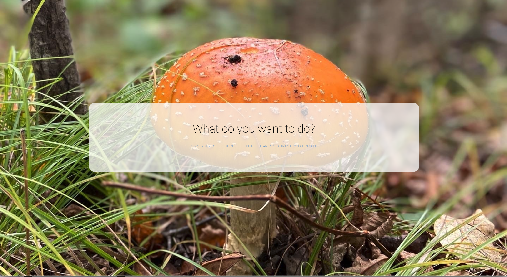
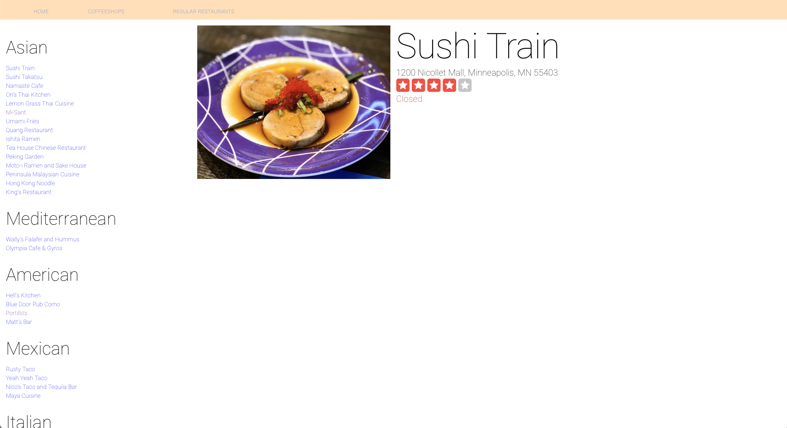

## Description

An app that leverages the Yelp API and Mapquest API to 1) find local coffeeshops and their driving distance based off an inputted address and 2) display a list of some of my regular restaurants

## To Run

- Change `YELP_BEARER_TOKEN` and `MAPQUEST_KEY` to authentication tokens from Yelp & Mapquest in `constants.ts`. I didn't include my personal keys because that seems like it could be a security thing but you can either request your own from Yelp & Mapquest or slack me for my keys.
- `yarn start` Run app locally.
- Turn off CORS in whatever browser you want to view this in.
  Because of CORS as a security protocol but mostly a pain in this instance, I found the simplest method for me was to open up a Safari page and turn off CORS in Preferences > Advanced > Show Develop Menu in Menu Bar >> Develop > Disable Cross-Origin Restrictions

## To Do List

- ~~Get rid of redux~~
- ~Why won't that `any` type go away~
- Expand radius of coffeeshops
- Group together coffeeshops of the same chain
- ~~Sort by driving time~
- Filter by driving time
- Sort by walking time
- Filter by walking time
- Search by inputted term and not just coffee
- use react query instead of axios
- ~~Add Regular Restaurant Rotation List~~
- Make the list scroll because I couldn't figure it out and it's 3:30am
- Also figure out why the CSS for buttons isn't sticking
- Create a random restaurant picker based off of certain inputs like type of food, distance, and price (and limit to time it is open)
- Create a restaurant bracket page to help indecisive groups find a place to eat
- Make a backend so I don't have to have a whole list

## Current Iteration

## Past Iterations

